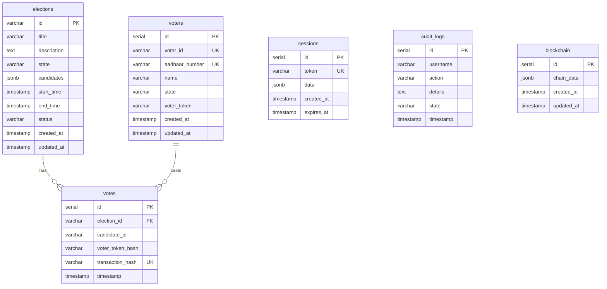
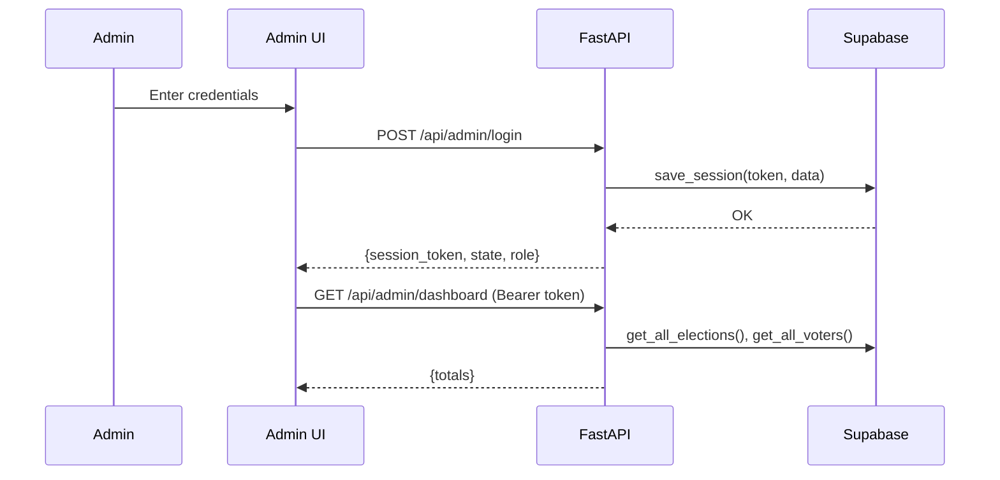
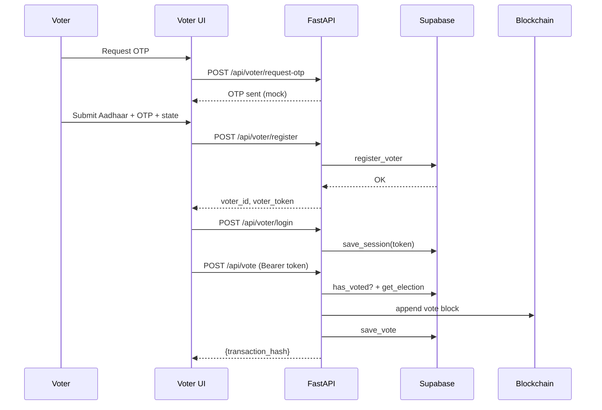
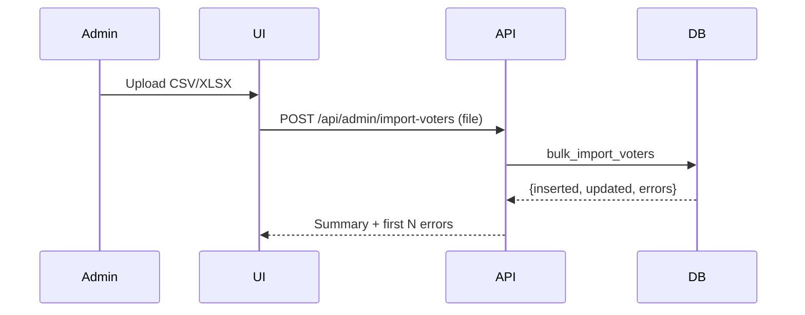

# Software Design Specification (SDS)

This SDS describes the detailed design for SecureVoteChain, a FastAPI-based, blockchain-enabled, state-aware voting platform with Supabase/PostgreSQL as the production database and a JSON fallback for development.

## 1. Overview / Purpose

- Purpose: Define the system design for an online, tamper-evident voting platform with admin and voter portals, state-level scoping, and auditable records.
- Goals: Security, transparency (blockchain), scalability (Supabase/Postgres), and usability (clean admin UI, public stats).
- Scope: Backend API (FastAPI), web UI (HTML/JS), database schema (Supabase), blockchain layer (internal Python chain), import/export tools, and analytics.

## 2. System Architecture Design

### 2.1 Architectural Overview

- Client: Admin and voter web UIs served from `templates/` and `static/` (vanilla JS, Chart.js, i18n, theme manager).
- API: FastAPI app (`main.py`) exposes REST endpoints for auth, elections, votes, analytics, blockchain, audit logs, and import/export.
- Database: Supabase/PostgreSQL (primary) via `backend/supabase_db.py`; optional JSON-file fallback (dev).
- Blockchain: Internal Python blockchain via `backend/blockchain.py` for tamper-evident vote recording and verification.
- Auth: Session tokens persisted in DB (`sessions` table); admin and voter flows separated.
- Security: Row Level Security (RLS) in Supabase with policies; HTTPS in production; tokens hashed for privacy in votes.

### 2.2 Component Diagram

```mermaid
flowchart LR
	subgraph Client
		A[Admin UI]
		V[Voter UI]
		P[Public Pages]
	end

	subgraph Server (FastAPI)
		API[main.py]
		AUTH[Auth Layer]
		MODS[Modules: Elections/Votes/Audit/Import]
		BC[Blockchain]
	end

	subgraph Data
		DB[(Supabase Postgres)]
		RLS[Row Level Security]
		S3[(Supabase Storage):::optional]
	end

	A-->API
	V-->API
	P-->API
	API-->AUTH
	API-->MODS
	MODS<-->DB
	AUTH<-->DB
	API<-->BC
	RLS---DB

	classDef optional fill:#eee,stroke:#999,color:#666
```

## 3. Module Design

### 3.1 Authentication Module

- Files: `backend/auth.py`, `main.py` (routes), `backend/supabase_db.py` (sessions persistence)
- Responsibilities:
	- Admin login (`/api/admin/login`): validates admin credentials, mints session token, stores session JSON in `sessions`.
	- Voter login/registration: OTP flow (mock), session token with voter token and state.
	- Role-based access helpers: `check_admin_access`, `check_voter_access` to guard routes.
- Data:
	- Sessions table stores JSON `data` with `type`, `state`, `role`, `username/voter_id`, timestamps.
- Errors:
	- 401 (no Authorization header), 403 (role mismatch), 500 (unexpected server error).

### 3.2 Election Management Module

- Files: `main.py` endpoints, `backend/supabase_db.py` methods.
- Responsibilities:
	- Create election: `POST /api/admin/elections` (admin state-scoped).
	- List elections: `GET /api/elections` (filtered by session state unless super admin).
	- Read one: `GET /api/elections/{id}`.
	- Export results: `GET /api/elections/{id}/export?format=json|csv` (admin-only, state-scoped).
- Data:
	- `elections` table with `candidates` JSONB array, status, times, state.
- Notes:
	- Ensure function name alignment in DB adapter (`save_election` vs `add_election`) to avoid runtime errors.

### 3.3 Voting Module

- Files: `main.py`, `backend/supabase_db.py`, `backend/blockchain.py`.
- Responsibilities:
	- Cast vote: `POST /api/vote` — verifies voter session, election state match, active status, and double-vote prevention; records on blockchain and DB.
	- Vote status: `GET /api/vote-status/{election_id}` for current voter.
	- Results: `GET /api/elections/{election_id}/results` — aggregates votes per candidate.
	- Verification: `POST /api/verify-vote` and `GET /api/verify-vote/{tx_hash}` — verify presence on blockchain.
- Data:
	- `votes` table stores `voter_token_hash` (hashed token, privacy), `transaction_hash`, timestamps.

### 3.4 Blockchain Interaction Module

- Files: `backend/blockchain.py` (in-memory chain with persistence via Supabase `blockchain` table).
- Responsibilities:
	- Append vote blocks with transaction hash.
	- Validate chain (`is_chain_valid`), export/import chain (`save_blockchain`/`load_blockchain`).
- Interfaces:
	- `get_chain()`, `get_block_by_hash(hash)`, `load_chain(data)`.

### 3.5 Admin & Audit Module

- Files: `main.py`, `static/admin.js`, `backend/supabase_db.py`.
- Responsibilities:
	- Dashboard stats: `GET /api/admin/dashboard`.
	- Voters list: `GET /api/voters` (admin-only, state filtered).
	- Votes list: `GET /api/votes` (admin-only, state filtered by election set).
	- Audit trail: `POST /api/audit-log`, `GET /api/audit-logs?limit=N`.
	- Bulk import/export: `POST /api/admin/import-voters`, `GET /api/admin/download-voter-template`.
- Data:
	- `audit_logs` table with username, action, details, state, timestamp.

## 4. Database Design

### 4.1 Schema Diagram / ER Diagram



### 4.2 Data Dictionary

- elections: (id, title, description, state, candidates[jsonb], start_time, end_time, status, created_at, updated_at)
- voters: (id, voter_id, aadhaar_number, name, state, voter_token, created_at, updated_at)
- votes: (id, election_id -> elections.id, candidate_id, voter_token_hash[sha256], transaction_hash[unique], timestamp)
- sessions: (id, token[unique], data[jsonb with role, state, ids], created_at, expires_at)
- audit_logs: (id, username, action, details, state, timestamp)
- blockchain: (id, chain_data[json array], created_at, updated_at)

Indexes: see `database_schema.sql` for state/status/time indexes and optimization ANALYZE statements.

## 5. Interface Design

### 5.1 API Endpoints

- Public/UI pages: `GET /`, `/admin`, `/voter`, `/verify`, `/statistics`, `/candidate`
- Admin Auth: `POST /api/admin/login`
- Voter Auth: `POST /api/voter/request-otp`, `POST /api/voter/register`, `POST /api/voter/login`
- Elections:
	- `POST /api/admin/elections` (create; admin-only, state-scoped)
	- `GET /api/elections` (state-filtered by session)
	- `GET /api/elections/{election_id}`
	- `GET /api/elections/{election_id}/results`
	- `GET /api/elections/{election_id}/export?format=json|csv` (admin-only; state-scoped)
- Voters/Votes (admin): `GET /api/voters`, `GET /api/votes`
- Voting: `POST /api/vote`, `GET /api/vote-status/{election_id}`
- Verification: `POST /api/verify-vote`, `GET /api/verify-vote/{transaction_hash}`
- Analytics: `GET /api/analytics/voter-turnout`, `GET /api/analytics/election-stats/{election_id}`
- Audit: `POST /api/audit-log`, `GET /api/audit-logs?limit=N`
- Misc: `GET /api/states`, `GET /api/blockchain`, `GET /api/blockchain/verify`, `GET /api/public/statistics`, `GET /health`
- Import/Template: `POST /api/admin/import-voters` (CSV/XLSX), `GET /api/admin/download-voter-template`

Request/response schemas match Pydantic models in `backend/models.py` where applicable.

### 5.2 Smart Contract Interfaces (ABI)

- Current system uses an internal Python blockchain (not an on-chain smart contract). No external ABI is required.
- Migration path (optional future): define an EVM contract with events for vote casting and Merkle proofs for audit; ABI would expose `castVote(electionId, candidateId, proof)`, `getResults(electionId)`, `verify(txHash)`.

## 6. Security Design

- Supabase Row Level Security (RLS): Enabled on all tables; policies grant full DML only to `service_role`. For development, permissive policies or temporary disables may be applied for `sessions`/`audit_logs` as needed.
- Secrets: `SUPABASE_URL`, `SUPABASE_KEY` via environment variables (`python-dotenv` for local).
- Token privacy: Store `voter_token_hash` (SHA-256) in votes; do not store raw tokens in votes.
- Role separation: Admin vs Voter sessions; endpoints guarded by `check_admin_access` / `check_voter_access`.
- HTTPS & CORS: Use HTTPS in production; CORS permissive during development, tighten in prod.
- Input validation: Pydantic models and server-side checks for state eligibility, election status, and rate limiting (recommend enabling at proxy level).
- Audit trail: All admin actions logged to `audit_logs`.

## 7. Sequence Diagrams / Workflow

### 7.1 Admin Login and Dashboard



### 7.2 Voter Registration and Voting



### 7.3 Import Voters



## 8. Error Handling & Exception Flow

- Authentication: 401 when missing token; 403 when role/state mismatch.
- Elections: 404 when not found; 403 on state mismatch for admin; 400 on invalid status/time window.
- Voting: 400 on double vote; 403 on wrong state or token mismatch; 404 on unknown election.
- Import: 400 on bad format/missing columns/empty file; 500 on parse/storage errors.
- Audit/Session RLS: If RLS blocks insert, log warning and return success to UI with fallback message; adjust Supabase policies in prod.
- Global: Unhandled exceptions return 500 with minimal leak of internals; server logs retain tracebacks.

## 9. Testing Plan

### 9.1 Unit Testing

- Auth utils: token generation/validation; Aadhaar mock validator.
- DB adapter: stub Supabase client to test `save_election`, `get_all_elections`, `save_vote`, `has_voted`, `save_session`.
- Blockchain: block creation, hashing, chain validation.

### 9.2 Integration Testing

- End-to-end admin flows: login → create election → export results.
- Voter flows: register → login → vote → verify.
- Import: upload valid/invalid files; assert counts and errors.
- Analytics: computed stats match fixture data.

### 9.3 Security Testing

- RLS policy verification: ensure writes require service role; sessions/audit logs handled per policy.
- Authorization bypass checks: admin-only endpoints with voter token; cross-state access attempts.
- Input fuzzing for injections and CSV formula injection on exports.

## 10. Deployment Design

- Environment: Uvicorn/Gunicorn behind reverse proxy (Nginx) with HTTPS.
- Configuration: `.env` with `SUPABASE_URL`, `SUPABASE_KEY` (service key recommended on server-side), `UVICORN_WORKERS`.
- Database: Apply `database_schema.sql`; adjust RLS for `sessions`/`audit_logs` or use service role on server.
- Static assets: Served by FastAPI or CDN; cache headers for static.
- Observability: Access/app logs, error monitoring; basic `/health` endpoint.

## 11. Maintenance & Version Control

- Git workflow: feature branches → PRs → main; semantic versioning for releases.
- Coding standards: Black/Flake8, type hints (mypy optional).
- CI: Lint + tests on PR; optional deploy pipeline.
- Data migrations: SQL scripts versioned (e.g., `database_schema.sql`, `fix_sessions_rls.sql`).

## 12. Technology Stack / Tools Used

- Backend: FastAPI, Uvicorn
- Database: Supabase/PostgreSQL
- Data: pandas, openpyxl (import/export)
- Frontend: HTML/Jinja, vanilla JS, Chart.js, QRCode.js; i18n (`static/translations.js`), theme (`static/theme-manager.js`)
- Auth: Session tokens (DB-backed)
- Security: Supabase RLS, HTTPS, token hashing
- Dev: python-dotenv, VS Code

## 13. Appendices (Diagrams, References, Glossary)

- Diagrams: Mermaid diagrams embedded above (Component, ER, Sequences)
- References:
	- `SRS.md` — Software Requirements Specification
	- `database_schema.sql` — full DDL + policies
	- `fix_sessions_rls.sql` — dev-time RLS adjustments
	- `SecureVoteChain/main.py`, `backend/supabase_db.py`, `backend/blockchain.py`
- Glossary:
	- RLS: Row Level Security policies in Postgres/Supabase
	- Service Role: Supabase server-side key with elevated privileges
	- Voter Token: Secret assigned to voter; stored hashed in `votes`
